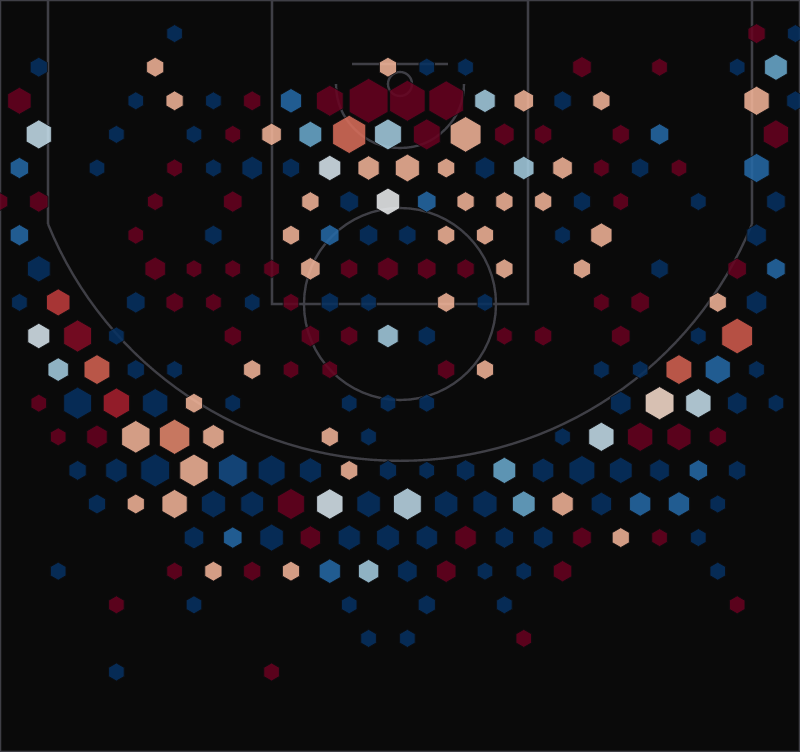

# NBA Shooting Dashboard

An interactive dashboard for the 2024-25 NBA season: live standings and scores, a
sortable shooting-stats table, and D3 hexbin shot charts built from a full season
of shot-location data.



## Features

- **Standings & scores** reconstructed from a committed snapshot of the [balldontlie](https://www.balldontlie.io/) API.
- **Shooting stats table** — 300+ players, sortable on any column and filterable by
  player or team (TanStack Table). Each player links to a **detail page** with their
  shooting splits and, for featured players, an inline shot chart.
- **Shot charts** — every field-goal attempt for a featured player, binned into a
  hexagonal density map on an SVG court (hexagon size = shot frequency, color = make rate).
- **Team pages** — season record, recent games, and the team's shooting leaders.

## Stack

Next.js 16 (App Router) · React 19 · TypeScript · Tailwind CSS v4 · TanStack Table ·
D3 (d3-hexbin, d3-scale) · Zod · Vitest.

## Architecture & key decisions

**Two data sources, picked for reliability.** The interesting constraint here was
data. The obvious source, `stats.nba.com`, silently drops requests from datacenter
IPs, so anything deployed to a serverless host can't reach it. The dashboard avoids
that entirely:

- **Team & game data (balldontlie, snapshotted):** teams and the full season game log. The free tier also blocks datacenter IPs, so the deployed app can't
  call it directly either. Instead a build step (`npm run build:live`) runs off-platform,
  uses the resilient API client to pull the season once, and commits the result as
  `src/data/season-snapshot.json`. The free tier has no standings endpoint, so standings
  are **derived** from the snapshot's finished games (`src/lib/standings.ts`).
- **Shot data (committed):** the shooting table and shot charts come from a published
  season shot log. A build step (`npm run build:data`) downloads it, aggregates
  per-player shooting splits, and carves out per-player shot maps, writing JSON that
  ships with the app.

The 2024-25 season is complete, so both snapshots are final and the deployed site
never depends on an external host at request time.

**Resilience over a flaky free tier.** The API client (`src/lib/api/client.ts`)
injects auth, validates responses with Zod at the boundary, and waits out the free
tier's aggressive rate limiting — honoring `Retry-After` through repeated 429s so a
multi-page sweep completes. That client powers the build-time ETL rather than the
request path, so production has no runtime dependency on the API.

**D3 for math, React for the DOM.** The shot chart uses D3 only to compute the
hexbin layout and scales; the SVG itself is rendered as plain React elements. That
keeps the component declarative and testable without imperative DOM manipulation.

**One honest caveat:** the shot log has no free throws, so the table's points-per-game
is _field-goal points only_. It's labelled as such everywhere rather than passed off
as true PPG.

## Getting started

```bash
npm install

# Regenerate the committed datasets (already in the repo). Both ETLs run
# off-platform; the season snapshot needs a free balldontlie key in .env.local
# as BALLDONTLIE_API_KEY.
npm run build:data   # shooting table + shot charts
npm run build:live   # standings, scores, team pages

npm run dev
```

Open http://localhost:3000. The app is served entirely from committed data, so it
needs no API key or network access to run.

## Testing

```bash
npm test
```

Vitest covers the API client (retry, rate-limit, error paths), the Zod schemas, the
standings derivation, the shot coordinate transform, the shooting-data integrity, and
the chart's hexbin rendering.

## Project structure

```
src/
  app/                 routes: home, /players, /players/[id], /shot-chart, /teams/[id]
  components/          ShootingTable, ShotChart, CourtMarkings, ShotExplorer, PlayerShotChart, SiteHeader
  lib/
    api/               balldontlie client, typed functions, Zod schemas (used by the ETL)
    court.ts           half-court geometry + coordinate transform
    standings.ts       standings derived from games
    shooting.ts        loader for the aggregated shooting data
    seasonData.ts      loader for the committed season snapshot
    shots.ts           loaders for per-player shot maps
  data/                generated shooting-stats.json, season-snapshot.json
scripts/
  build-shot-data.mjs  shot-log ETL
  build-live-data.ts   season-snapshot ETL (teams, games)
public/shots/          generated per-player shot maps
```

## Data credit

Shot-location data from the public
[NBA shots dataset](https://github.com/DomSamangy/NBA_Shots_04_25). Live game and
team data from [balldontlie](https://www.balldontlie.io/).
